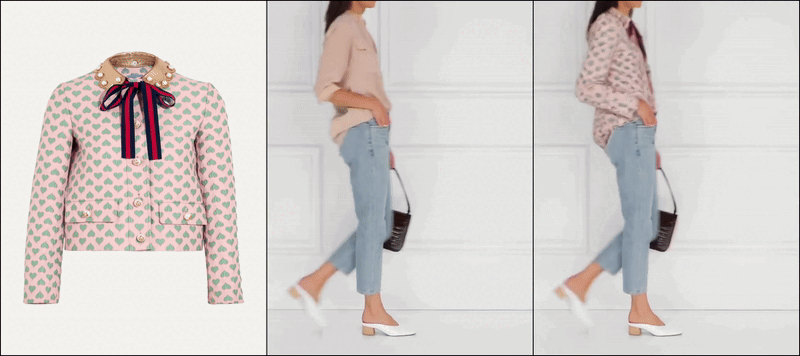
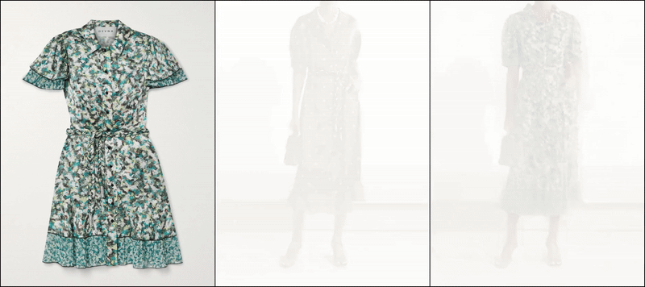
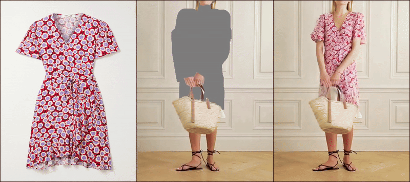
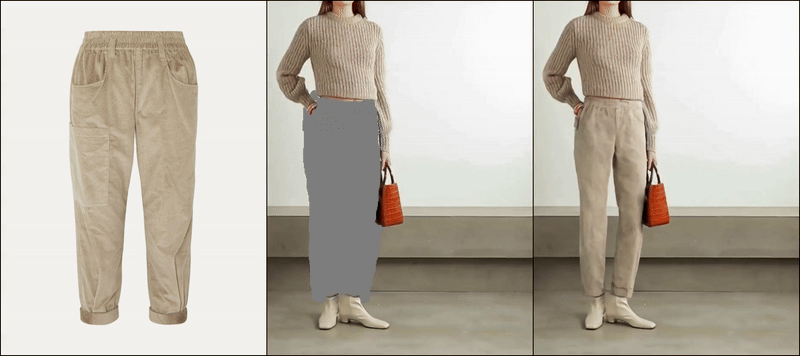

# RealVVT: Towards Photorealistic Video Virtual Try-on via Spatio-Temporal Consistency


This repository is the official implementation of [RealVVT](https://arxiv.org/abs/2501.08682)

<!-- > **StableVITON: Learning Semantic Correspondence with Latent Diffusion Model for Virtual Try-On**<br>
> [Jeongho Kim](https://scholar.google.co.kr/citations?user=4SCCBFwAAAAJ&hl=ko), [Gyojung Gu](https://www.linkedin.com/in/gyojung-gu-29033118b/), [Minho Park](https://pmh9960.github.io/), [Sunghyun Park](https://psh01087.github.io/), [Jaegul Choo](https://sites.google.com/site/jaegulchoo/) -->

[[arXiv Paper](https://arxiv.org/abs/2501.08682)]&nbsp;
<!-- [[Project Page](https://rlawjdghek.github.io/StableVITON/)]&nbsp; -->

<p align="center">
  
  
  <br>
  
  
</p>

## TODO List
- [x] ~~Inference code~~
- [x] ~~Training code~~

## Environments
```bash
git clone https://github.com/FOURSEVEN-L/RealVVT
cd RealVVT
conda env create -f environment.yaml


```

## Pretrained Models
- SVD (Stable Video Diffusion xt): [Download](https://huggingface.co/stabilityai/stable-video-diffusion-img2vid-xt)
- SD (Stable Diffusion 2.1): [Download](https://huggingface.co/stabilityai/stable-diffusion-2-1)

## Datasets
- VITON-HD: [Download](https://github.com/shadow2496/VITON-HD)
- DressCode: [Download](https://github.com/aimagelab/dress-code)
- ViViD: [Download](https://huggingface.co/datasets/alibaba-yuanjing-aigclab/ViViD)

## Dataset Structure (Training/Inference)
For both video virtual try-on and image data, use:

```
Video_dataset
|-- videos
|-- densepose
|-- agnostic
|-- agnostic-mask
|-- images

```

## Preprocessing
### Agnostic and Agnostic Mask Videos
This preprocessing step requires generating body-agnostic representations. You can obtain them through any of these methods:

1. Follow [OOTDiffusion](https://github.com/levihsu/OOTDiffusion) to extract frame-by-frame.
2. Use [SAM](https://github.com/facebookresearch/segment-anything) or [sapiens](https://github.com/facebookresearch/sapiens)  + Gaussian Blur.(follow [ViViD](https://github.com/alibaba-yuanjing-aigclab/ViViD))
2. Mask editor tools.

### Densepose video
See [vid2densepose](https://github.com/Flode-Labs/vid2densepose).(follow [ViViD](https://github.com/alibaba-yuanjing-aigclab/ViViD))
## Inference
```bash
sh ./run_inference_json.sh
```


## Training
We increased the in_channels of SVD U-Net from 4 to 9 channels.

```bash
sh ./run_train.sh
```

## Citation
If you find our work useful for your research, please cite us:
```
@article{li2025realvvt,
  title={RealVVT: Towards Photorealistic Video Virtual Try-on via Spatio-Temporal Consistency},
  author={Li, Siqi and Jiang, Zhengkai and Zhou, Jiawei and Liu, Zhihong and Chi, Xiaowei and Wang, Haoqian},
  journal={arXiv preprint arXiv:2501.08682},
  year={2025}
}
```

**Acknowledgements** Haoqian Wang is the corresponding author.

## License
Licensed under the CC BY-NC-SA 4.0 license (https://creativecommons.org/licenses/by-nc-sa/4.0/legalcode).
